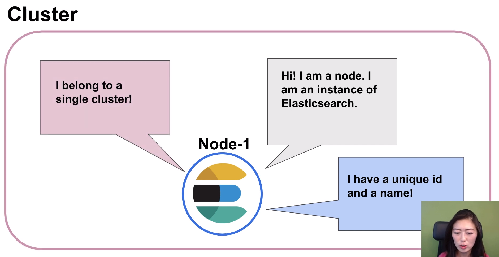

# Elasticsearch crush course cheto-tam
asdasd

#### Table of Contents

1. [About][About]

d

## About

Elasticsearch is is a powerful search and analytics engine it's known for its distributed nature, speed and scalability - and this is due to its unique architecture.

once elastic elasticsearch is up and running you now have an instance of elasticsearch, also known as **node**. Each node has a unique *id* and a *name*, and it belongs to a single **cluster**.

---

when you start up a node a cluster

is formed automatically

and you could have one to many nodes in

a cluster

and these nodes are distributed across

separate machines

but they all belong to the same cluster

and work together to accomplish a task

so let's really bring this concept home

so think about a team that you have been

a part of

your team consists of multiple members

who all work together to accomplish a

common goal

and your team could divide and conquer

by assigning each member

one or multiple roles and these

are the roles that you're going to

specialize in now your team members may

work in different buildings

but you all still belong to the same

team and this analogy could directly

apply to nodes in a cluster

for example nodes are members of

a cluster that share a common goal

now nodes are distributed across

separate machines

but they're still part of the same

cluster

nodes are assigned to one or multiple

roles

and one of the roles that i know it

could be assigned to is to hold

data and that is what we'll be focusing

on today

so data is stored as documents

in a document is a json object that

contains whatever

data you want to store in elasticsearch

so let's go back to our online grocery

shop example

now we're helping our customers search

for grocery items online

so we need to store grocery data in

elasticsearch

now a document for one grocery item

would look like this

so in a json object it contains the name

of the product

category belongs in its brand and price

and things are much easier to find when

you group them in a logical manner

and documents that share similar traits

and are logically related to each other

are grouped into an index so for example

documents of clementines and carrots

would be grouped under produce index

documents of malbecs and ipas would be

grouped under

wine and beer index so to sum it up

indices are used to group documents that

are related to each other

so we know where to find certain

information

okay so let's delve into this a little

bit more

so here we have a cluster of nodes we

have a produce index

and wine and beer index now index

is not actually storing documents it's

just a

virtual thing that keeps track of where

documents are stored now you can't find

index on disk

what actually exists on disk is a shard

so shard is where data is stored

and this is where you run a search

so when you create an index one chart

comes with it by default

and you can configure it so that you can

create an index with

multiple charts that are distributed

across nodes

and this is a practice called sharding

and there are a lot of super powers that

come with this practice

so let's say you have a cluster that

looks like this and you want to create a

produce index

that will keep track of all produce

documents

now when you create an index one chart

is created by default

and the shard is assigned to a node

and remember shard is where documents

are stored

and number of documents a shark could

hold depends on the capacity of the node

let's say you want to index 600 000

documents in your produce index

but the node where the chart is assigned

to could hold

only hold 200 000 documents

well that's not gonna work right well we

do have two more nodes

which could hold 200 000 documents each

so what you can do is you can add two

additional charts

in the index and distribute them across

these nodes

and each chart could hold two hundred

thousand documents

so together they hold six hundred

thousand documents

now that is all fine and dandy but our

produce data is only going to grow so

how are we going to adapt to increasing

data now that

is the beauty of sharding so you could

add more shards and nodes as the needle

rises

so you could horizontally scale and

adapt to increasing data

but that's not the only superpower that

comes with charting

now remember shard is where you store

documents

and it's also where you run search

queries

so let's talk about a scenario where the

client is sending a search request

for pink lady apples now in this

in this scenario you have one chart in a

node

that could hold the entire produce index

now let's say this produce index keeps

track of

500 000 documents and we're going to run

a search

in the single shard meaning we'll go

through

500 000 documents sequentially

now let's say it takes you 10 seconds to

do that

now this time we're going to run the

same search with a different setup

so we'll have 10 charts distributed

across 10 nodes

and we'll distribute 500 000 documents

across

10 charts so that each shard

holds 50 000 documents each

now in the previous scenario it took us

10 seconds to sequentially search

through 500 000 documents

and if you do the math running a search

on 50 000 documents

should take one second

now what's so cool about this setup is

that you could run a search

on all 10 of these charts at the same

time

in parallel now guess how long it takes

to search through

500 thousand documents with this setup

one second so as you can see sharding

could really speed up your search

now in the first case onenote had to

store all the info

and process all incoming search with

this setup

we could only store as much data and

process search requests as a single

machine

now in the second case we distributed

data across

charts and allows shards to process

search requests

in parallel so not only do we have the

capacity to store more data

we could now search at scale

so let's say everything is going well

with our online grocery shop

but all of a sudden one of our nodes go

down and we lose our data forever

i mean i don't even want to imagine it i

mean that would be a nightmare

and we want to avoid this at all costs

so what we could do

is we could make copies of the original

charts and store its copies across

different nodes so look at nodes

one and two and these nodes contain our

original shards

also known as primary shards

that's what p stands for now we're going

to make

copies of each shard and store these in

nodes 3 and 4. and these are known as

replica shards and that's what r stands

for

so r0 is a replica shard of

primary shard 0. r1

is a replica chart of primary shard one

and what this does is that if one node

were to go down

everything's okay because we have a

replica of our data somewhere else

but that's not all there's an additional

superpower

that comes with replica shards which is

it could improve

the performance of your search

so let's say you have two primary sharks

distributed across

two nodes and you're currently getting 2

000 search queries per second

and these search queries are being ran

in these two primary shards

now as our app is getting more popular

the search queries have increased to

8 000 queries per second and your two

primary charts

are having trouble keeping up with the

demand so to solve this

you could add more notes and increase

the number of

replica shards of p0 and p1

and remember that these replicas are

identical copies

of the primary shards so now these

replica shards can pick up the slack

and your cluster could better handle

increased demands on search

all right so now that you understand the

basics of elasticsearch we're going to

move on to the hands-on lab

so we finally get to play with

elasticsearch and kavanagh

so the goal of this lab is to get

familiarized with crowd operations

so in other words how do we create read

update and delete a document from

elasticsearch

before the workshop i've asked you to

download elasticsearch and kibana

and have these running on your computer

now if you didn't get a chance to do

that

no worries this meetup is recorded so

you can follow along later

okay so i'm going to share a github repo

via chat right now

okay so this repo contains the link to

today's presentation

and the blog for teaching you how to

download and run elasticsearch in cabana

and the request we'll be using to run

crud operations

now for those of you who are watching

this video after the event i will also

include a repo in the description

section of this video

now those of you who are here with me

right now click on the link to the repo

and keep this tab open

okay so i'm just going to gloss over the

part about running elasticsearch and

kibana

now a lot of you have completed these

steps before we started the workshop

and the step-by-step directions on what

we're about to breeze through

are included in the repo

now so far i have downloaded

elasticsearch and cabana from elastic

website

and i moved them to my desktop now

unzipped both products by double

clicking on them

and on your right what you're seeing is

the unzipped folders

of elasticsearch and cabana now we're

going to run these two products

by using the command line interface so

let's pull up our terminal

now i have three tabs open so the first

tab is running elasticsearch

so i just cd into elasticsearch which is

located in my desktop

and then i ran the command bin forward

slash

elasticsearch now you use this command

if you're on

mac or linux and if you're on windows

you run bin backslash elasticsearch.bat

now if you are following my blog to

learn how to run

elasticsearch on windows you could just

run elasticsearch.bat

okay now click on your terminal and

hold command f and we're going to look

for

9 200.

now you'll see an ip address

ending in 9200 here so

what's that all about well elasticsearch

provides a rest

api that allows you to communicate with

your cluster

and in other words when you send

requests to elasticsearch

you're sending a http request to this

rest api

whose endpoint is localhost at port

9200.

so if you see this ip address and don't

see any error messages

we should be good to go now just make

sure to keep this tab open when you're

working with elasticsearch

otherwise you'll shut it down

okay so we just talked about how

elasticsearch provides a rest api

that allows you to send http requests to

your cluster

so let's make sure we could send a

request to the rest api

so in our second tab i read a curl

command

which sends a request to localhost 9200.

now if you see this response with

information about our cluster

and version number of elastic search

that means that our cluster could

receive requests

now in the third tab i'm running cabana

and this is very similar to

running elasticsearch so cd into kibana

which is located on your desktop

and run bin for slash cabana if you

are on mac or linux

now if you're on windows you can run bin

backslash cabana.bat now if you are

following my blog to learn how to run

kabana on windows

then just run kibana.bat

all right now if you scroll down you'll

see that the server is

running at localhost 5601

copy and paste that into your browser

and you'll see this interface all right

so what we just went over was the

prerequisite work

and now we're going to dive into the lab

so

before we get to that let's just get

organized here so i'm going to minimize

this terminal

and pull up

github repo i shared with you earlier

okay now i'm gonna wait a few seconds

for you to catch up

and let me know if you need me to zoom

in on anything

all right so let's get started with the

lab just be ready to follow along on

your computer

so we just downloaded and ran an

instance of elasticsearch

also known as node now when you start up

a node a cluster is formed automatically

and the best practice is to name your

cluster

and node to something that is meaningful

to you and the reason you do that

is because as your apps get bigger you

may be working with multiple clusters

with

multiple nodes that are responsible for

different tasks

so it's really important that you could

differentiate what each one does

okay so let's change the name of our

cluster and node

so open up your terminal again and open

a new tab

now we're going to cd into elasticsearch

which is located

in our desktop

and then we're going to open it up with

a text editor

now you'll see elasticsearch here expand

it

and then go to config directory and then

you'll see

elasticsearch.yml file now this file

allows you to configure a lot of things

for elasticsearch

but for today's workshop we're only

going to focus on cluster

and node now let's scroll down to line

17

uncommented and we're going to change

the cluster name

now you can name this to whatever makes

sense for your use case

but for our workshop we're going to name

it elastic

underscore crash course

now scroll down to node name on comment

line

22 and we're going to name this crud

under oops crud underscore

node now make sure to save it

and minimize it now

we need to stop and restart elastic

search and cabana

for this name changes to take place so

go back to

the terminal where you're running

elastic search click on the terminal

then hold ctrl c

now this is gonna stop elastic search

and then we're gonna use the exact same

command

that we use to run elasticsearch

now it takes a couple of seconds for it

to start running so let's

give that a little rest

all right here we go

okay so we see the 9200 here we're good

to go

now let's go to the terminal that's

running cabana click on the terminal

hold ctrl c to stop cabana and run the

same command that you

used to run cabana earlier

now this is going to take a few seconds

to load up as well

all right great now cabana is running at

localhost 5601

so let's minimize our window

okay now let's get organized here a

little bit so on the left we have the

kibana interface

and on the right we have the repo

so go back to the cabana browser

click on the menu icon located on the

upper left corner

scroll all the way down to management

and click on dev tools

now you'll see the cabana console here

so on the left is where you

send the request to elasticsearch and on

the right

is where you receive the response from

elasticsearch

so we're gonna get rid of this default

search query here

so we could enter our own okay

so we're going to start by checking the

health of our cluster

and the syntax will follow for that is

get

then api that we want to get information

from

and the parameter that retrieves the

info that we're looking for

so if we're looking for information

about cluster health

we would say get from cluster api

health information about our cluster so

let's copy and paste that

into our cabana console make sure it's

selected

meaning that this dark gray bar is over

the request

and then click on this arrow to run it

now we get a response from elasticsearch

which says

cluster is named elastic crash course

status is green meaning it's healthy now

if you look at line five

it says we have one node which makes

sense because we only have one running

instance of elasticsearch

okay so next we're going to get more

information about our node

so scroll down to get info about nodes

in a cluster

and what we're saying here is get from

nodes api stats

about our nodes so let's copy that

and paste it here make sure to select it

and run it okay so we get

the information about nodes so it says

we have

one node in a cluster named elastic

crash course

now node is named crud node and then

you'll see

the ip address roles attributes

a lot of information about notes

that we're not going to go over right

now but just for now remember that

this request is really helpful when

you're debugging a node

because you get to inspect the node more

in detail

all right so we're going to move on to

the crud operations

in other words how do we create read

update and delete a document

so for this exercise we're going to

store documents about our favorite candy

so by now you know that documents are

logically grouped into an index

and as a best practice we're going to

create an index

first so let's get back to our repo

scroll down

to create an index so the syntax that

we're going to follow

is put followed by name of the index

now since we're indexing documents about

our favorite candy

our index is going to be named favorite

underscore

candy all lowercase so let's copy and

paste

this request here

make sure to select it and run it now if

you say acknowledge

true it means that index favorite candy

has been successfully created

okay so now that we have an index

let's index some documents and this time

i'm using index as a verb to mean that

we're storing documents in elasticsearch

so when you're indexing a document both

post or put can be used now you use

post when you want elasticsearch to auto

generate an id for your document so the

syntax that you're going to follow for

that

is post name of the index then

document endpoint followed by a json

object that contains

all of the data that you want to store

in a document

so in our case we're saying post in

favorite candy the following document

so let's copy and paste that here

make sure to select the first line of

the request

and send it now you see a 201 response

which says index favorite candy has a

document

with an auto-generated id

and this document has been created

okay now turn to your repo and scroll up

a little

now we just mentioned that when indexing

a document

document either post or put can be used

so if you scroll down to put

now you use put when you want to assign

a specific

id to your document so a time where you

might want to use this

is when you're indexing data with

natural identifier

so for example let's say you're indexing

patient data

where each patient has a unique id

now documents may be easier to work with

if if it had the same id

as a patient id rather than an

auto-generated id that has no meaning

so it's easier to keep everything

uniform right

so this time we're going to index a

couple more documents using put

so if you look at the repo the syntax

that you're going to follow

is put name of the index document

endpoint

and id that you want to assign to this

document

followed by a json object that contains

whatever information that you want to

store

so in our use case we'll say put

in favorite candy index the following

document

and assign it an id of one

so let's copy and paste that

now make sure to select the first line

of the request

and send it now you'll see a 201

response

that says in favor candy index document

with an assigned id of 1

has been created now pay attention to

version number one here we'll go over

this in a second

okay so we're gonna index more documents

so i'm gonna copy

our last request and paste it twice

okay so i'm gonna give this document an

id of two and i'll say rachel's favorite

candy

is rolos

and i'm gonna give the following

document an id of three

and say tom favorite candy

is

[Music]

sweet tarts okay

so let's select this line here the first

line of document two

and send it

all right now it says in index favorite

candy

document with an assigned id of 2 has

been created

and we'll do the same for tom's document

select the first line

and send it yep a document with an id of

3

has been created okay so now that we

have indexed some documents

i want to send a request to see the

content of the document that has been

indexed

now this is the read part of crowd

operation

so turn to your repo scroll down to

read and the syntax that you're going to

follow

is get the name of the index

document endpoint and id of the document

that you want to retrieve

so in our case we say get from

index favorite candy a document with an

id of one

so let's copy and paste that right under

john's document

make sure to select it and send it

so here we'll see a response of

document with an id of one now if you

look at line 9

source you'll see the content of

document one

so this is a great way to check whether

our crowd operations have worked or not

okay so what do you think would happen

if we accidentally

index another document using the id that

already exists

well let's find out so let's go back to

the request for

a document with an id of one

i'm gonna copy and paste it below

now i'm gonna say

sally's favorite candy

is snickers

and i'm gonna index this document with

an existing id of one

all right make sure to select the first

line of the request

and send it huh

so this looks a little bit different

right so you get

a 200 response and it says

a document with an id of one has been

updated now if you look at version

you'll see that it's 2. so what this

version is saying

is how many times your document has been

created updated or deleted so

let's just take a look to see

what happened so we're going to go back

to the get request that we used

and send it

so if you look at line nine you'll see

that

john's document has been overwritten

with sally's

but that's not good right we don't

actually want to

overwrite a an existing document

now to prevent that from happening you

could use the create

endpoint so go back to your repo and

scroll

up to create endpoint

now the syntax that you're going to

follow is put

the name of the index then create

endpoint

and id you want to assign the following

document

so in our case we're saying put in

favorite candy index

the following document and assign it on

id of one

but if this id already exists

then don't do anything just throw on

error

so let's copy this request

and i'm going to paste it right under

sally's

make sure to select the first line and

send it

so it's throwing a 4 9 error message

and the reason for that is won't the

document already exist so let's just

double check and make sure

that sally's information has not been

replaced

so we'll click on get requests that we

used earlier

and send it all right good

so sally's information still exists

okay so the create endpoint provides a

safeguard for you

so you don't accidentally overwrite your

document

okay so let's move on to update scroll

down

to update now there will be times where

you want to update an existing document

so for example let's say sally

originally liked

snickers but she changed her mind her

favorite candy now

is eminem's so let's go back to our repo

and the syntax that you're going to

follow is post

followed by name of the index then

update endpoint then id of the document

that you want to update

now in a json object make sure that you

have

doc as a context and what this telling

what this is telling you is that okay

i want to update this document but

only the fields with the values that i

specify

inside this curly bracket so what we're

seeing here

is post in favor candy index

i want to update a document with idea

one

now please note that i only want to

update the field candy with m ms

so let's copy and paste that

right under sally

make sure to select your first line of

the request

and send it okay so now it's saying that

document one

has been updated and the version number

is three now that makes sense because

document 1 has been originally created

with john's information

then we accidentally updated with

with sally's then we purposely

updated the field candy with m ms

okay so we're gonna just double check

to make sure everything worked go back

to the get request that we just used

and send it again now you'll see that

document 1

and if you look under source candy has

been updated to m

ms

okay so last but not least what if we

want to delete

a document well this one is super simple

so let's scroll down here

now the syntax that you're going to use

is delete the name of the index

then document endpoint then id

of the document that you want to delete

so in our case

we're saying delete from favorite candy

index

document with an id of one so let's copy

that

and paste it under

update

request for m ms okay

so to just make sure you select this

request and send it

all right now doc 1 has been deleted

now version is now 4.

and that's a wrap for the hands-on lab

okay so we got some great questions from

our audience so i'll answer them now

so raymond asks for people who come from

relational database management system

background like sql

server how does this elastic database

compare to it

well elasticsearch is actually not a

database

it does store documents but it's a

search

and analytics engine so elastic search

is schema free

and it's built on top of lucine so it's

designed to excel

at full text searches now another

differentiator

is that you could really fine-tune the

relevance of your search results

when it comes to precision ranking and

recall

so i would say if these factors are

important to you

then you might want to consider using

elasticsearch

okay raymond also asked is node like

tables

and clusters like servers and sql server

so raymond i do the same thing so

when i learn something new i try to see

if there's

anything analogous between the system

that i understand

and the new product that i'm learning

about

now i would say these are apples and

oranges so they don't really compare

now i feel like there's an underlying

question here so perhaps my

explanation of nodes and cluster were

not quite clear

so if you want to follow up feel free to

email me at lisa.jung

elastic.com

okay so igor asked do the nodes use

cache

to find the data that is being searched

yes you're absolutely right

so the nodes use cache at the level of

elastic search and operating system so

you could retrieve information faster

okay so the name wasn't associated with

this question in the chat

but someone asked if linux commands are

same as mac terminal

yes absolutely they're identical

okay so lymphord asks what is the best

way to perform charting with one node

well i wouldn't recommend having

multiple shards in one node

and the problem with that is if your

node goes down your data is lost forever

and also having shards in different

nodes allows you to perform searches in

parallel

so perhaps there's something that i

don't quite understand about your use

case

so if you want to follow up you could

email me at my email address here

okay so raymond asked what are some

disadvantages with using elastic stack

now i don't think you can have a generic

answer to this question about any

products really

it really depends on what you're working

with and what you're trying to

accomplish

so if i were to decide on which products

to use

i think about the metrics that are

really important in my use case

and pick products that are best fit for

that so based on your

questions um it seems that you come from

the sql world

so i know that elasticsearch doesn't

support

joins or transactions but then again

it's about

choosing products that are best fit for

your use case

and weighing the pros and cons based on

what you're working with

okay so partha asked at which point does

using elasticsearch give value

versus searching through a sql database

empirically inside the

database note that there's an overhead

in maintaining yet another microservice

okay so i get a sense that the

underlying question here

is you're trying to determine whether

elasticsearch might be a fit for your

use case

now this question is hard to answer

without clearly understanding the

problems that you're trying to solve

so if you have a list of metrics that

really matter to your use case and are

open to sharing it with me

i'd be happy to connect you with someone

that specializes in that area

so you can make a decision that is best

for you christopher

asks do you have any experience and or

can you recommend using redis with an

established elf stack

now i haven't used redis with an

established elastic stack

and this question is hard to answer

without knowing what you're using red is

for

so if you like to follow up and share

that with me via email

then i could share that with the team

member who might be more familiar with

it

now i think the best way to get this

question answered

is by using the disqus forum so

we have a huge global developer

community

and they use the elastic stack in

diverse use cases with various setups

so someone in the community might have

experience with redis

and guide you in the right direction now

i included the link to the disqus

form here and in the description of the

video

okay so raymond asked what's with the

errors and warnings

so what he's referring to is the error

messages that he saw while kavanaugh is

loading

so the whole point of running

elasticsearch in kibana together

is so that we could send requests to

elasticsearch from kabana

so when we start up kibona it's

immediately trying to send requests to

elasticsearch

now remember when we started

elasticsearch it takes some time to

fully

get up and running and during the demo

while elastic

search was still loading i fired up

cabana

so what you're seeing is kibana trying

to send requests to elasticsearch and

failing

because elasticsearch has not been fully

loaded to connect to kubana yet

okay last question partha asked does

elasticsearch have support to secure

9200 and 5601 authentication

tokens and etc yes so you could secure

your cluster for free

by adding user authentication and

encrypted communications

so here are some resources to get you

started and i'll also include these

links in the description of this video

as well

alright so if you like the beginner's

crash course

the elastic stack remember that this is

a series of workshops

now i'm planning a second workshop in

january

and we'll talk about more advanced stuff

that you could do with elasticsearch

and build on what we've learned now if

you want to be updated on our next

workshop

join the elastic austin user group i'll

be posting our next workshop info

here and i'll include a link to this

meetup group in the description

okay so last but not least if you have

any questions about the content of my

presentation

feel free to send me an email now if you

have more general questions

then the discussion forum is a great

place to get your questions answered

so we have a huge archive of questions

asked and answered by developers

and we have a really active community

answering questions

and also a great team of developer

advocates monitoring this forum as well

now also i'm going to be blogging a lot

about elasticsearch

so if you prefer to learn by reading

instead be sure to check out my blog

and lastly i wanted to thank phoebe

quincy our community program associate

for hosting this workshop with me

now without her the series doesn't run

so thank you

all right so that's a wrap and i'll see

you guys next year

